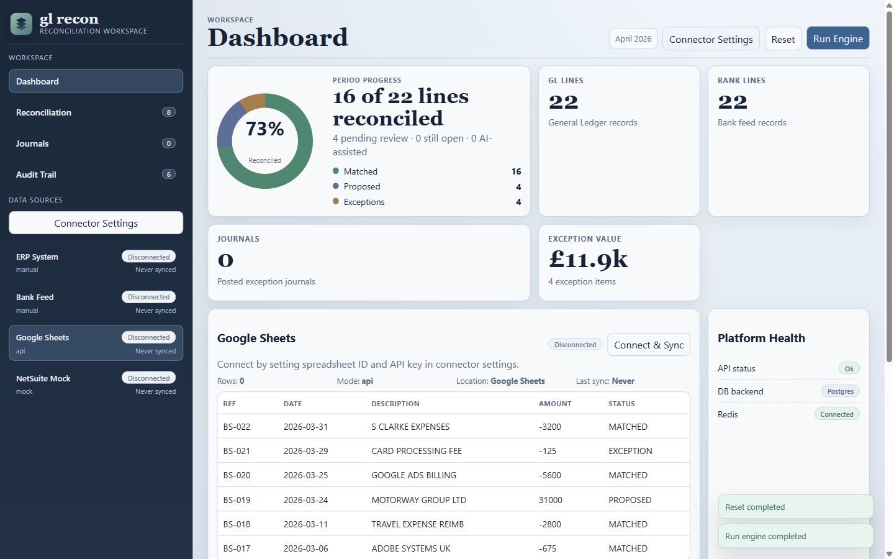
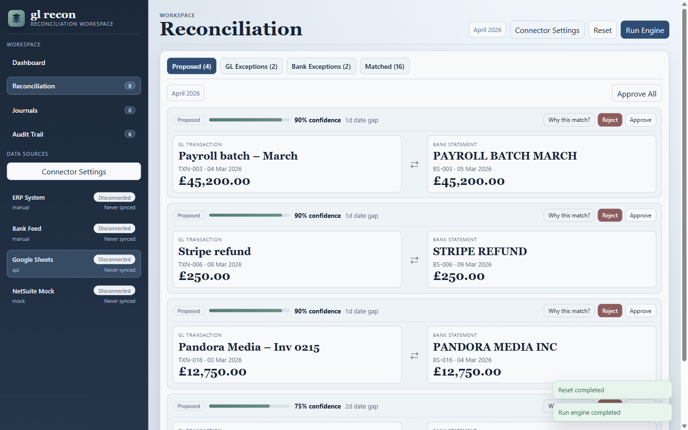
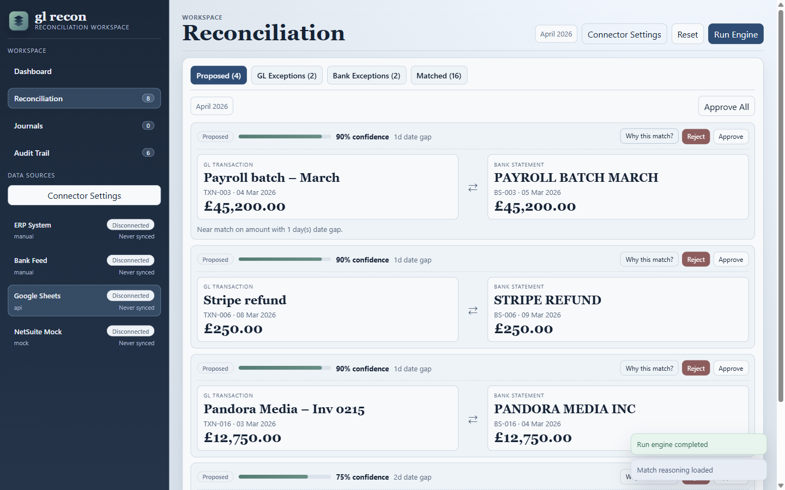
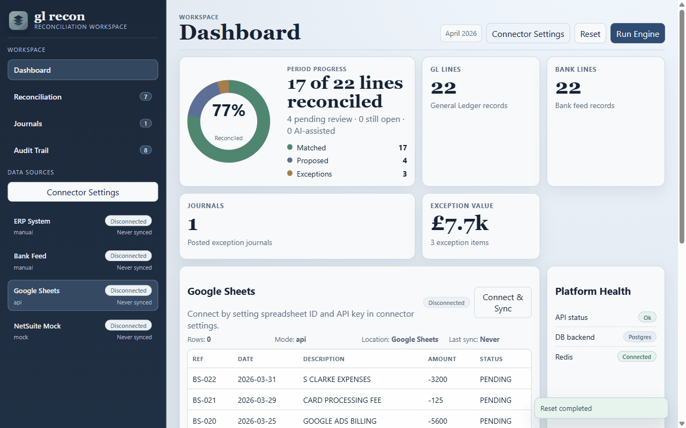

# GL Reconciliation Engine

A working demo of an end-of-period general ledger reconciliation workflow, built to explore the technical patterns behind ERP closing processes.

The engine matches GL transactions against a bank feed using a three-pass algorithm (exact, near-match, AI-assisted), surfaces exceptions for analyst review, and posts double-entry journals for unmatched items. It connects to real data sources via CSV upload and a Google Sheets connector.

---

## Screenshots









---

## Stack

| Layer | Technology | Why |
|---|---|---|
| Frontend + API | Next.js 14 (App Router) + React 18 | Unified server/client routing; API routes in the same project |
| Language | TypeScript throughout | End-to-end type safety across domain, API, and UI |
| Database | PostgreSQL 16 via Prisma | Typed ORM, relational schema for financial data, decimal precision |
| Cache | Redis 7 via ioredis | Short-lived dashboard cache; readiness check on health endpoint |
| AI assist | OpenRouter (free tier) | LLM-backed third matching pass for hard exceptions |
| Contracts | Protocol Buffers (protobufjs) | Binary serialisation endpoint demonstrating typed service contracts |
| Infrastructure | Terraform on GCP (Cloud Run + Cloud SQL + Redis) | Declarative IaC scaffold mirroring a production cloud deployment |
| CI | GitHub Actions | Lint → test → build on every push |

See [docs/TECHNICAL_DECISIONS.md](docs/TECHNICAL_DECISIONS.md) for the rationale behind each choice and the alternatives considered.

---

## Quick start — Docker (recommended)

The fastest way to run the full stack locally. Requires Docker Desktop.

```bash
git clone https://github.com/travisparnold2003/gl-recon.git
cd gl-recon
docker compose up
```

Open [http://localhost:3000](http://localhost:3000).

The app seeds sample GL and bank transactions automatically on first start. Press **Run Engine** to run the reconciliation passes.

**To enable AI-assisted matching (Pass 3):** open `docker-compose.yml`, set `OPENROUTER_API_KEY` to a valid key, then restart with `docker compose up`. A free key can be created at [openrouter.ai](https://openrouter.ai). Passes 1 and 2 work without any key.

---

## Quick start — Local dev

Requires Node 20, a local PostgreSQL instance, and optionally Redis.

```bash
git clone https://github.com/travisparnold2003/gl-recon.git
cd gl-recon
npm ci
cp .env.example .env    # edit DATABASE_URL and optionally REDIS_URL / OPENROUTER_API_KEY
npm run db:push         # push schema to Postgres
npm run seed            # load sample data
npm run dev
```

Open [http://localhost:3000](http://localhost:3000).

---

## How to use the demo

1. The sidebar shows four data sources: ERP System (GL), Bank Feed, Google Sheets connector, and a NetSuite mock.
2. Press **Run Engine** to run reconciliation against the seeded sample data.
3. Go to **Reconciliation** to see proposed matches. Click **Why this match?** to see scoring rationale.
4. Approve or reject individual pairs, or **Approve All** at once.
5. For GL and bank exceptions, click **Use AI** to generate an LLM explanation (requires OpenRouter key), or write manual notes.
6. Click **Post Journal** on any exception to create a double-entry journal entry.
7. Go to **Journals** to review posted entries and export as CSV.
8. Go to **Audit Trail** to see a log of all system actions.
9. Press **Reset** to return to the original sample data.

**Google Sheets connector:** in Connector Settings, paste a published CSV URL from a Google Sheet formatted with columns `bank_ref, date, description, amount, type`. Click **Connect & Sync** to pull it as the bank feed.

---

## API reference

All endpoints return JSON. When `API_AUTH_TOKEN` is set in the environment, write endpoints require `Authorization: Bearer <token>`.

| Method | Path | Description |
|---|---|---|
| GET | `/api/health` | Platform readiness: API, DB, Redis |
| POST | `/api/reconcile` | Run the three-pass matching engine |
| GET | `/api/dashboard` | Stats, proposed pairs, exceptions, journals |
| POST | `/api/approve/:glId/:bankId` | Approve a proposed match |
| POST | `/api/reject/:glId/:bankId` | Reject a proposed match |
| POST | `/api/journal/gl/:id` | Post journal for GL exception |
| POST | `/api/journal/bank/:id` | Post journal for bank exception |
| POST | `/api/explain/exception/:type/:id` | Generate AI explanation for exception |
| GET | `/api/explanation/:type/:id` | Retrieve stored explanation |
| PUT | `/api/explanation/:type/:id` | Save manual explanation note |
| GET | `/api/match-reasoning/:glId/:bankId` | Retrieve match insight for a pair |
| GET | `/api/export/journals` | Download journal entries as CSV |
| GET | `/api/contracts/dashboard-proto` | Dashboard response as Protobuf binary |
| POST | `/api/reset` | Reset to sample data |

---

## Reconciliation algorithm

**Pass 1 — Exact match**
Matches GL and bank records with the same absolute amount and the same date. Confidence: 100%.

**Pass 2 — Near match**
Same absolute amount, date gap ≤ 3 days. Confidence decays by gap: 0 days → 95%, 1 day → 90%, 2 days → 75%, 3 days → 60%.

**Pass 3 — AI assist** *(requires OpenRouter key)*
For remaining exceptions, scores candidates using a weighted function (amount 55%, date 25%, description token overlap 20%). The top candidates above a 0.42 score threshold are sent to an LLM which returns a proposed match with confidence and reasoning. Maximum 6 LLM calls per engine run.

All proposals from Passes 2 and 3 require analyst approval before becoming matched.

---

## Project structure

```
app/                    Next.js pages and API route handlers
src/
  components/           React UI components
    hooks/              Custom React hooks
    views/              Per-tab view components
  server/
    domain/             Reconciliation engine (pure matching logic)
    services/           Orchestration, business workflows, DB queries
    lib/                DB, Redis, CSV, auth, OpenRouter helpers
    seed/               Sample data loader
  lib/                  Shared utilities (formatting)
  types/                Shared TypeScript types
prisma/schema.prisma    PostgreSQL data model
proto/                  Protocol Buffer service contracts
infra/terraform/        GCP Cloud Run + Cloud SQL + Redis scaffold
docs/                   Architecture, decisions, deployment, roadmap
```

---

## Assumptions and simplifications

This is a learning project and demo, not a production system. Key simplifications:

- **Single-period, full reset:** the engine resets all transaction state on every run. Production systems would reconcile incrementally against a period boundary.
- **One-to-one matching only:** the engine matches each GL line to exactly one bank line. Real ERP reconciliation often requires one-to-many and split-settlement logic.
- **No authentication by default:** `API_AUTH_TOKEN` is optional. In production, every write endpoint would require auth and the app would run behind an identity proxy.
- **Redis as read cache:** Redis caches the dashboard response for 5 seconds (invalidated on every write). In production it would also serve as a distributed lock for concurrent reconciliation runs.
- **OpenRouter as LLM gateway:** used because it provides free access to capable models without needing a direct API contract. In production you would use a direct provider with retry/fallback logic and cost controls.
- **Terraform scaffold only:** the IaC files define real GCP resources but are not applied to any live account. They demonstrate the intended production topology.
- **Sample data is hardcoded:** the seed loads a fixed set of GL and bank transactions designed to produce a mix of exact matches, near-matches, and exceptions.

---

## CI

GitHub Actions runs on every push to `master` / `main` and on all pull requests:

```
npm ci → npm run lint → npm run test → npm run build
```

---

## Production deployment (GCP)

See [docs/GCP_DEPLOY_GUIDE.md](docs/GCP_DEPLOY_GUIDE.md) for Terraform-based deployment to Cloud Run + Cloud SQL + Redis.
